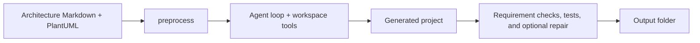

# Code Agent

Code Agent is a simplified, desktop code-generation agent inspired by Claude Code. It reads an `Architecture_Documentation.md` file and an `Architecture_View.md` file containing PlantUML views, then uses the DeepSeek API to generate a project that follows the stack and user workflows described in those inputs.

## Features

- Tkinter desktop interface for selecting the API key, two architecture inputs, and output folder.
- Markdown and PlantUML preprocessing into structured architecture data.
- A DeepSeek tool-calling loop with safe workspace-only file tools and user-action pause/resume.
- The official OpenAI-compatible DeepSeek API endpoint using model `deepseek-v4-pro`.
- Required-deliverable checks, Python syntax/import checks, repeated repair/recheck until checks pass or the user cancels, and generated pytest/npm test execution.
- Architecture-aware generation: documented web/graphical applications must include a real UI, not just backend APIs; browser applications must include an HTML entry page.
- Credit-free **Verify output** action to recheck an existing generated folder after installing its runtime, without making a DeepSeek request.
- Cancellation, progress logs, and a redacted `RUN_LOG.txt` in generated output.
- Windows executable packaging and GitHub Actions CI/release automation.

## Architecture

The preprocessor turns the documentation and PlantUML into structured JSON. The agent supplies that JSON to DeepSeek, which can only write, read, and list files inside the output workspace. The agent is instructed to follow the documented language and implement user-facing flows as working interfaces. The output is checked for a README, dependency manifest, tests, and—when the architecture describes a web app—an interactive HTML UI. Python syntax and likely undeclared imports are checked; Python projects run pytest and Node.js projects run their `npm test` script. Failed checks are sent back to the model repeatedly until they pass or the user cancels. If a Node test reports a missing declared package, the app runs `npm install` in the generated project folder and retries the test. If the test runtime is missing or installation fails, generation ends as incomplete without waiting for a dialog or making another model request. The separate **Verify output** action remains local-only and never calls DeepSeek.



## Run from source

1. Install Python and create an environment if desired.
2. Install dependencies:

   ```sh
   python -m pip install -r requirements.txt
   ```

3. Start the desktop app:

   ```sh
   python main.py
   ```

4. Optionally verify packaged resources and imports without opening the GUI:

   ```sh
   python main.py --selftest
   ```

## Use the `.exe`

1. Start `CodeAgent.exe`.
2. Enter a DeepSeek API key.
3. The bundled `Architecture_Documentation.md` and `Architecture_View.md` samples are selected automatically; use **Browse...** to choose different files.
4. Select an existing output folder.
5. Click **Run**. The log tracks progress; **Cancel** requests a safe stop. The agent repeats repair requests for project-code failures until checks pass, so retries can use additional DeepSeek credits. If a generated Node project is missing a declared package, the app installs dependencies in that output folder and reruns the tests. A missing runtime or failed dependency install ends the run as incomplete; it does not keep waiting for confirmation or make more model requests.
6. To recheck an existing output after installing Node.js or Python, select its folder and click **Verify output (no API)**. This does not use DeepSeek credits or change generated files.

The app asks before writing into a non-empty output folder. When generation ends, use **Open output folder** to inspect the generated project and `RUN_LOG.txt`.

## Build the `.exe` locally on Windows

The Windows executable must be built on Windows. From a Windows shell with dependencies installed, run:

```bat
scripts\build_exe.bat
```

The resulting executable is `dist\CodeAgent.exe`. A reference shell command for non-Windows environments is in `scripts/build_exe.sh`, but it does not produce a Windows executable.

## Tests

Run the full test suite with:

```sh
python -m pytest -q
```

Tests use fake API clients and mocks; they do not make DeepSeek network requests.

## CI/CD

GitHub Actions runs tests on Ubuntu and Windows for every push and pull request. After tests pass, the Windows job builds `CodeAgent.exe`, runs it with `--selftest`, and uploads it as the `CodeAgent-windows` workflow artifact. For version tags matching `v*`, the release job downloads that artifact and attaches it to a GitHub Release.

Download the executable from a successful workflow run’s artifacts, or from the matching GitHub Release for a version tag.

## Project structure

```text
.
├── main.py
├── samples/
│   ├── Architecture_Documentation.md
│   └── Architecture_View.md
├── scripts/
│   ├── build_exe.bat
│   └── build_exe.sh
├── src/code_agent/
│   ├── agent.py
│   ├── checker.py
│   ├── config.py
│   ├── llm.py
│   ├── paths.py
│   ├── preprocess.py
│   ├── runner.py
│   └── tools.py
└── tests/
```

## Limitations

- A DeepSeek API key with sufficient account balance and internet connection are required for generation. HTTP 402 insufficient-balance errors are reported directly; add funds to the DeepSeek account before retrying.
- DeepSeek responses can take time; the log displays the current request step and the 120-second request timeout while waiting.
- Generation is not marked complete unless the generated test suite actually passes. If a Node.js test reports a missing declared package, the app runs `npm install` in the generated project folder and retries the tests. If a test runtime is unavailable or installation fails, generation ends as incomplete instead of waiting on a dialog or making more DeepSeek requests. **Verify output** reports missing test prerequisites without installing packages or using DeepSeek credits.
- Generated output quality depends on the model and the supplied architecture documents.
- The packaged executable is Windows-only. It is unsigned, so Windows SmartScreen may show a warning.
