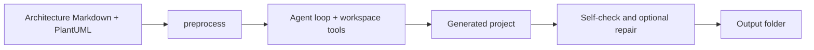

# Code Agent

Code Agent is a simplified, desktop code-generation agent inspired by Claude Code. It reads an `Architecture_Documentation.md` file and an `Architecture_View.md` file containing PlantUML views, then uses the DeepSeek API to generate a complete Python project in a selected output folder.

## Features

- Tkinter desktop interface for selecting the API key, two architecture inputs, and output folder.
- Markdown and PlantUML preprocessing into structured architecture data.
- A bounded DeepSeek tool-calling loop with safe workspace-only file tools.
- The official OpenAI-compatible DeepSeek API endpoint using model `deepseek-v4-pro`.
- Completion checks, syntax/import self-checking, up to two repair rounds, and generated-test execution when a system Python is available.
- Cancellation, progress logs, and a redacted `RUN_LOG.txt` in generated output.
- Windows executable packaging and GitHub Actions CI/release automation.

## Architecture

The preprocessor turns the documentation and PlantUML into structured JSON. The agent supplies that JSON to DeepSeek, which can only write, read, and list files inside the output workspace. After generation, the project is checked for required files, Python syntax, and likely undeclared imports; the agent can repair detected issues before results are returned.



## Run from source

1. Install Python and create an environment if desired.
2. Install dependencies:

   ```sh
   python -m pip install -r requirements.txt
   ```

3. Start the desktop app:

   ```sh
   python main.py
   ```

4. Optionally verify packaged resources and imports without opening the GUI:

   ```sh
   python main.py --selftest
   ```

## Use the `.exe`

1. Start `CodeAgent.exe`.
2. Enter a DeepSeek API key.
3. Select `Architecture_Documentation.md` and `Architecture_View.md`.
4. Select an existing output folder.
5. Click **Run**. The log tracks progress; **Cancel** requests a safe stop.

The app asks before writing into a non-empty output folder. When generation ends, use **Open output folder** to inspect the generated project and `RUN_LOG.txt`.

## Build the `.exe` locally on Windows

The Windows executable must be built on Windows. From a Windows shell with dependencies installed, run:

```bat
scripts\build_exe.bat
```

The resulting executable is `dist\CodeAgent.exe`. A reference shell command for non-Windows environments is in `scripts/build_exe.sh`, but it does not produce a Windows executable.

## Tests

Run the full test suite with:

```sh
python -m pytest -q
```

Tests use fake API clients and mocks; they do not make DeepSeek network requests.

## CI/CD

GitHub Actions runs tests on Ubuntu and Windows for every push and pull request. After tests pass, the Windows job builds `CodeAgent.exe`, runs it with `--selftest`, and uploads it as the `CodeAgent-windows` workflow artifact. For version tags matching `v*`, the release job downloads that artifact and attaches it to a GitHub Release.

Download the executable from a successful workflow run’s artifacts, or from the matching GitHub Release for a version tag.

## Project structure

```text
.
├── main.py
├── samples/
│   ├── Architecture_Documentation.md
│   └── Architecture_View.md
├── scripts/
│   ├── build_exe.bat
│   └── build_exe.sh
├── src/code_agent/
│   ├── agent.py
│   ├── checker.py
│   ├── config.py
│   ├── llm.py
│   ├── paths.py
│   ├── preprocess.py
│   ├── runner.py
│   └── tools.py
└── tests/
```

## Limitations

- A DeepSeek API key and internet connection are required for generation.
- Generated output quality depends on the model and the supplied architecture documents.
- The packaged executable is Windows-only. It is unsigned, so Windows SmartScreen may show a warning.
